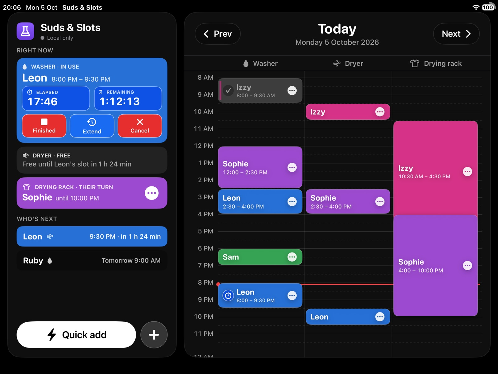
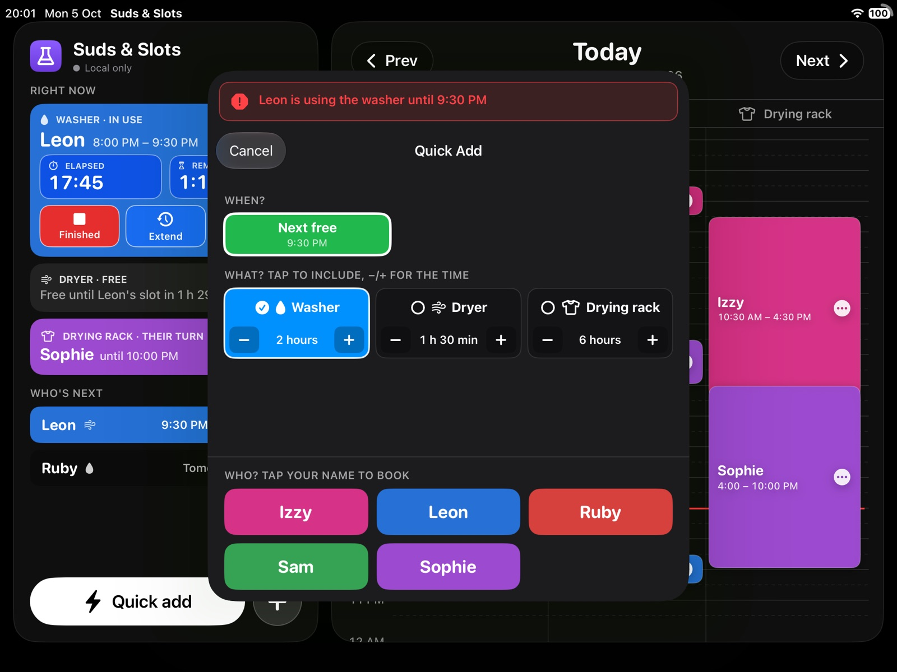
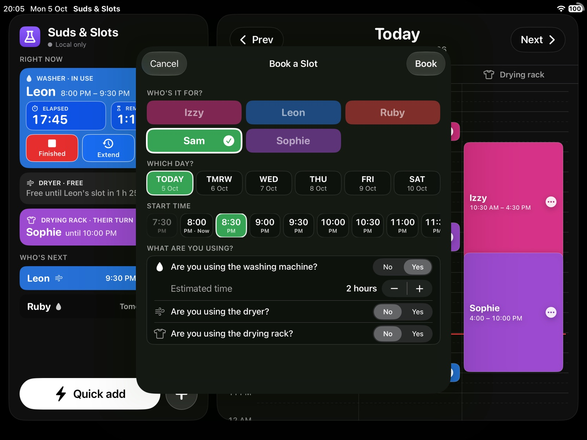
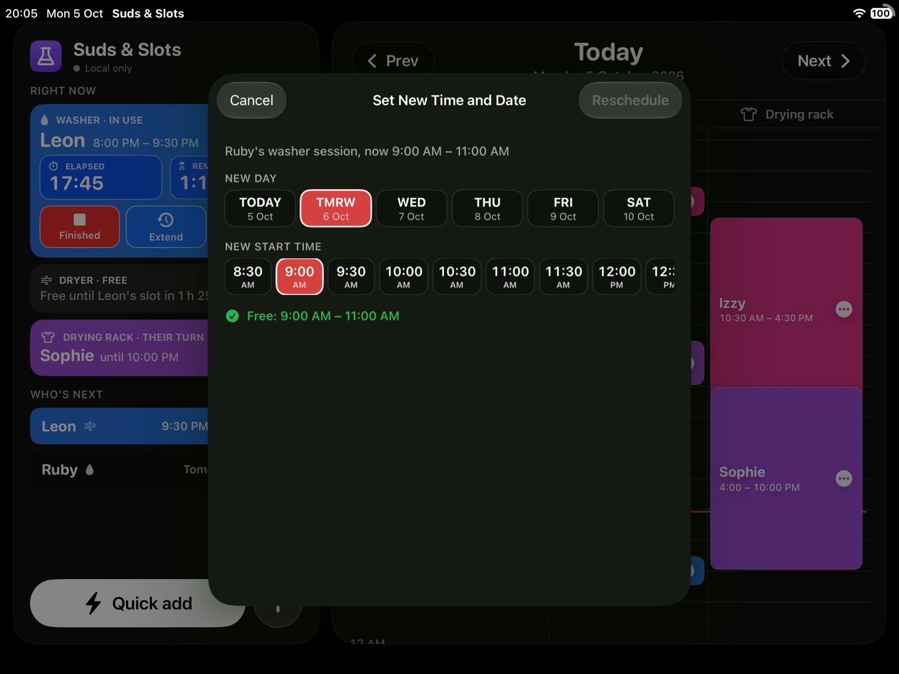
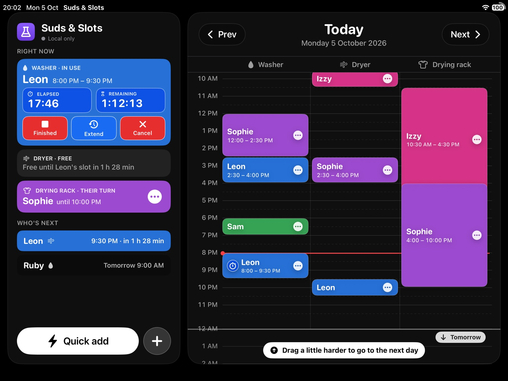
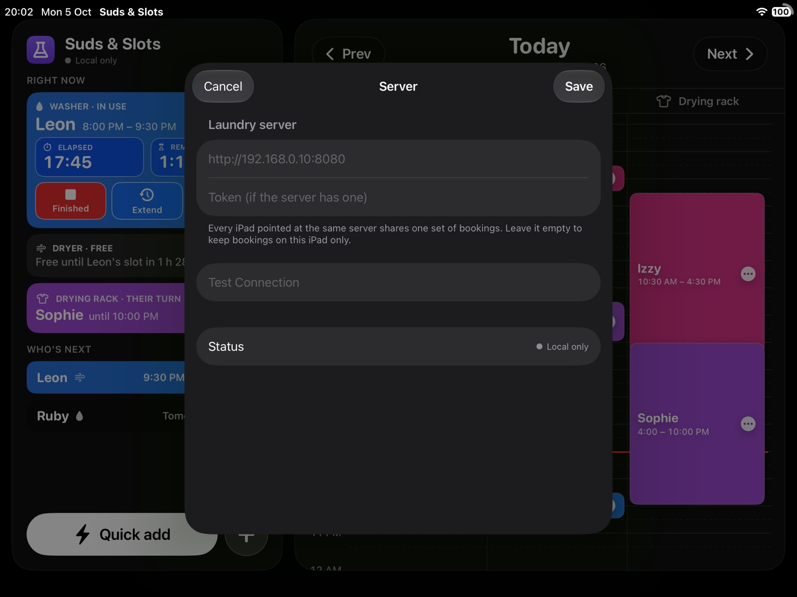
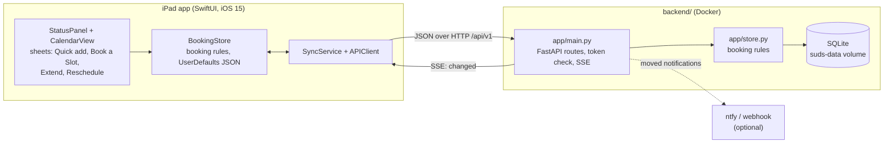

# Suds & Slots

A laundry-slot booking app for a shared household. It runs on an iPad left in
landscape by the machines, so anyone can see at a glance who is using the washer,
the dryer and the drying rack, how long their load has left, and who is next, and
can book or adjust a slot in a few taps. The idea is one shared timetable that
everyone can see, instead of guessing whose turn it is.

It is a native SwiftUI app for iPadOS 15, installed as a fake-signed `.deb` on
jailbroken iPads. Built for larger iPad (Air 2, 9th gen etc) displays. This may
work on an iPad mini but support is not guaranteed.

Bookings live on the iPad by default. An optional small server (FastAPI + SQLite
in Docker, in [`backend/`](backend/)) lets several iPads share one set of
bookings with live updates, and can tell people on their phones when their slot
has been moved.

## Screenshots

All screenshots were taken in the iPad (9th generation) simulator with the
`-demo` launch argument, so the people and bookings are sample data.


*The main screen. Left: what each machine is doing right now (with live elapsed and
remaining timers and Finished, Extend and Cancel buttons), who is next, and the
Quick add and Book a Slot buttons. Right: today's calendar from 8 AM to midnight,
one column per machine, with a red line for now.*


*Quick add: pick when and what, then tap your name to book. Here the washer is
busy, so it offers the next free time instead.*


*Book a Slot, the full form: who, which day, start time, and which machines with
an estimated time for each.*


*Rescheduling a session that has not started yet. The sheet says whether the new
time is free or who would be pushed along.*


*Pulling the calendar past midnight peeks at the next day; pull a bit further and
it switches to that day.*


*Server settings, opened by tapping the sync status under the title. Leave the
address empty to keep bookings on this iPad only.*

## Features

- **Right now panel**: per machine, who has it, live elapsed and remaining timers
  (turning yellow when over time), and buttons for Start, Finished, Extend,
  Reschedule and Cancel (only the ones that make sense at the time). Holding
  Start lets you say a load was put on earlier.
- **Who's next**: the next two bookings, the first in that person's colour.
- **Calendar**: washer, dryer and drying rack columns from 8 AM to midnight, Prev
  and Next buttons, finished sessions greyed out. Each bar's ⋯ menu adjusts that
  session. Pull past midnight to peek at the neighbouring day and snap into it.
  After five idle minutes it scrolls itself back to the default view.
- **Quick add**: book a wash in about three taps. Shows only free times, can
  "butt in" ahead of bookings that have not started (shoving them along), and can
  wash now and dry later when the dryer is busy.
- **Book a Slot**: the full form, with a booking chained across washer, dryer and
  rack back to back.
- **Extend and reschedule**: later bookings on the same machine are pushed back,
  and your own dryer or rack stage follows your wash. A night rule sends a pushed
  washer or dryer slot that would start at or after 10 PM (or in the small hours)
  to 12 PM the next day instead; the rack is silent, so it is exempt.
- **Confirmations** are native alerts with the question in the title.
- **Server mode** (optional): every iPad shares the same bookings, updated live
  over Server-Sent Events; a bell shows "your slot moved" notifications, which
  the server can also push to phones via [ntfy](https://ntfy.sh) or a webhook.
- Plain black background and native controls throughout.

## How to run

### Prerequisites

- A Mac with Xcode (tested with Xcode 27). Both builds target iOS 15.0.
- [XcodeGen](https://github.com/yonaskolb/XcodeGen) for the simulator project:
  `brew install xcodegen`.
- For the jailbroken-iPad `.deb`s: `brew install ldid dpkg`.
- For the server: Docker with Docker Compose.

### In the simulator (with demo data)

From the repository root:

```sh
xcodegen generate
xcodebuild -project SudsAndSlots.xcodeproj -scheme SudsAndSlots -configuration Debug \
  -destination 'platform=iOS Simulator,name=iPad (9th generation)' \
  -derivedDataPath DerivedData build
xcrun simctl boot "iPad (9th generation)"    # skip if it is already running
xcrun simctl install booted DerivedData/Build/Products/Debug-iphonesimulator/SudsAndSlots.app
xcrun simctl launch booted com.leonb.sudsandslots -demo -landscape
```

To watch it, open the simulator window (DeviceHub in Xcode 27, Simulator in
older versions). You can also open `SudsAndSlots.xcodeproj` in Xcode, add the
launch arguments to the scheme and press Run.

Current Xcode ships no iOS 15 simulator, so the simulator runs a newer iOS. The
swiftc build in `build.sh` targets iOS 15.0 and fails on any newer API, but
iOS 15 layout and behaviour quirks only show up on a real device.

Launch arguments (the Debug ones are compiled out of the `build.sh` release
build):

| Argument | Builds | What it does |
| --- | --- | --- |
| `-demo` | Debug | Seeds sample bookings (five people, a load running now) and ignores any saved server. |
| `-landscape` | Debug, iOS 16+ | Rotates to landscape, since the simulator can't be rotated headlessly. |
| `-mini4` | Debug | Pins the UI to 1024x768pt to preview a smaller screen. |
| `-idle15` | Debug | Cuts the idle auto-scroll wait from 5 minutes to 15 seconds. |
| `-serverSettings`, `-notifications <person>` | Debug | Open those sheets at launch, for screenshots. |
| `-syncSmokeTest`, `-syncPushTest` | Debug | Book, extend and shove through the store to exercise server sync without tapping. |
| `-server <url>`, `-token <secret>` | All | Use this server (and token) instead of the saved settings. |

### On a jailbroken iPad

```sh
./build.sh
```

This compiles with `swiftc` for arm64 and iOS 15.0, fake-signs with `ldid`, and
writes two Sileo packages to `build/`: `SudsAndSlots_0.1_rootless.deb` (installs
under `/var/jb`) and `SudsAndSlots_0.1_rootful.deb`. Install the one that matches
your jailbreak with Sileo, Filza or `dpkg -i`; the post-install script refreshes
the home screen with `uicache`. Set `BUILD_DIR=...` to build somewhere else.

App icon: `swiftc -parse-as-library scripts/make_icon.swift Sources/SudsAndSlots/Theme.swift -o /tmp/mkicon && /tmp/mkicon`
(run from the repository root; it rewrites `packaging/appicon/`).

### The server (optional)

```sh
cd backend
cp .env.example .env          # optional: port, token, ntfy, time zone
docker compose up -d --build
curl http://localhost:8080/health        # {"ok":true,"version":0}
```

Then on each iPad tap the sync status under the title, enter
`http://<server address>:8080` (and the token if you set one), tap **Test
Connection** and **Save**. The first time, the iPad uploads its own bookings;
after that the server is the source of truth. In the simulator you can launch
with `-server http://localhost:8080` instead.

If port 8080 is taken on your machine, set `SUDS_HOST_PORT` in `backend/.env`.
[`backend/README.md`](backend/README.md) covers every setting, ntfy alerts and
some `curl` checks, and [`docs/API.md`](docs/API.md) is the API contract.

### Tests

The backend has a pytest suite that runs inside the image against a
throwaway database and a controllable clock:

```sh
cd backend
docker compose build && docker compose run --rm --no-deps api pytest
```

The app has no automated tests; the debug launch arguments above are how it is
checked in the simulator.

## Architecture



- **Views.** `ContentView` puts the `StatusPanel` (left) beside the
  `CalendarView` (right), or stacks them on a narrow screen. Sheets handle Quick
  add, Book a Slot, Extend, Reschedule, server settings and notifications.
- **BookingStore** (`Models.swift`) holds every booking and enforces the rules:
  clashes per machine, chained stages, shoving along, extending and moving, own
  stages following, and the 10 PM night rule. Every change is checked against
  the rules before it is made. With no server it saves to UserDefaults as JSON,
  dropping anything older than a month.
- **Server mode.** With a server configured, `SyncService` applies each change
  locally straight away, then sends it to the server one at a time; the
  server's answer wins. It listens to `/api/v1/events` (Server-Sent Events, with
  polling as a fallback), refetches when anything changes or the app returns to
  the foreground, and caches the last server copy so the screen is not empty at
  launch.
- **Backend.** `app/store.py` implements the same rules as `BookingStore` on
  SQLite, `app/main.py` exposes them as the REST API in
  [`docs/API.md`](docs/API.md), streams change events, and stores
  notifications for anyone whose slot was moved by someone else (optionally
  sending them on to ntfy or a webhook).

### Project layout

| Path | What it is |
| --- | --- |
| `Sources/SudsAndSlots/SudsAndSlotsApp.swift` | App entry, `ContentView` layout, debug launch arguments |
| `Sources/SudsAndSlots/Models.swift` | People, machines, `Booking`, `BookingStore` (rules and storage), `BookingForm` |
| `Sources/SudsAndSlots/StatusPanel.swift` | Left panel: right now, who's next, Quick add and Book a Slot buttons |
| `Sources/SudsAndSlots/CalendarView.swift` | Day calendar, machine columns, pull past midnight to change day |
| `Sources/SudsAndSlots/BookingBar.swift` | A booking on the calendar and its ⋯ menu |
| `Sources/SudsAndSlots/QuickAdd.swift`, `BookingSheet.swift` | The two ways to book |
| `Sources/SudsAndSlots/ExtendSheet.swift`, `RescheduleSheet.swift` | Custom extend and set new time and date |
| `Sources/SudsAndSlots/ConfirmDialog.swift`, `IdleMonitor.swift`, `Theme.swift` | Confirmation alerts, idle tracking, colours and shared styles |
| `Sources/SudsAndSlots/Sync/` | `APIClient` (server settings and HTTP), `SyncService`, sync status and settings views |
| `backend/` | FastAPI + SQLite server, Dockerfile, compose file, pytest suite ([README](backend/README.md)) |
| `docs/API.md` | The contract between the app and the server |
| `packaging/` | `Info.plist`, entitlements and app icons used by `build.sh` |
| `scripts/make_icon.swift` | Renders the app icon from the same flask shape the app draws |
| `build.sh` | swiftc build, ldid fake-signing, rootless and rootful `.deb`s |
| `project.yml` | XcodeGen spec for the simulator project |

## Status and limitations

- Version 0.1, made for one household: the five people and three machines are
  fixed in `Models.swift` and `backend/app/store.py`.
- Packaged for jailbroken iPads on iOS 15 (as fake-signed `.deb`s); there is no
  App Store or developer-signed build. Larger iPads are the target; an iPad mini
  may work, but support is not guaranteed.
- The server is meant for a home network. It speaks plain HTTP (the app allows
  insecure loads for that reason) and its only protection is the optional shared
  `SUDS_TOKEN`, so do not expose it to the internet.
- Notifications reach phones only through ntfy or a webhook; the iPad app itself
  only shows them in its bell list.
